# ACCIDENT @ CVPR 2026: Zero-Shot Accident Detection Pipeline

[](https://www.kaggle.com/code/ameythakur20/zero-shot-cctv-traffic-accident-understanding/)
[](paper/)
[](preprint/)

A modular zero-shot pipeline for detecting, localizing, and classifying traffic accidents in CCTV surveillance video. Built for the [ACCIDENT @ CVPR 2026](https://kaggle.com/competitions/accident) competition hosted at the [AUTOPILOT Workshop](https://wad.vision/).

**Authors:** [Amey Thakur](https://orcid.org/0000-0001-5644-1575) · [Sarvesh Talele](https://orcid.org/0009-0002-0818-461X)

**Public Leaderboard Score:** `0.25230`

---

## Overview

Given a surveillance video, the pipeline predicts three things without any labeled real-world training data:

| Task | Method | Output |
|------|--------|--------|
| **When** did the accident happen? | Z-score peak detection on frame differences | Accident time in seconds |
| **Where** did the impact occur? | Weighted centroid of thresholded Farneback optical flow | Normalized (x, y) coordinates |
| **What type** of collision? | CLIP cosine similarity with multi-prompt text embeddings | One of 5 collision types |

The three modules are independent — each can be swapped or tuned without touching the others. No model weights are fine-tuned; the pipeline runs entirely on pre-trained CLIP (ViT-B/32) and classical computer vision.

<p align="center">
  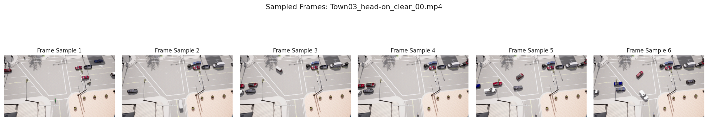
</p>

---

## Pipeline Architecture

### 1. Temporal Localization

Computes mean absolute frame differences, smooths with a rolling window (w=5), normalizes to z-scores, and selects the frame with the highest anomaly score above threshold (τ=1.5).

<p align="center">
  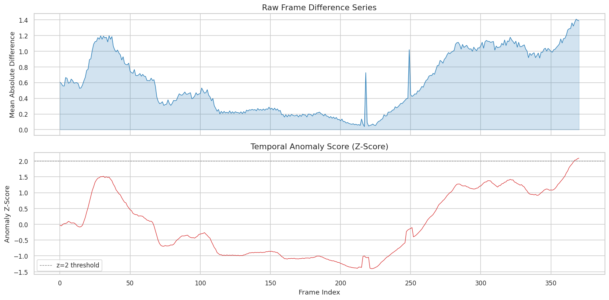
</p>

### 2. Spatial Impact Localization

Centers a 30-frame window on the detected accident time, accumulates Farneback dense optical flow magnitudes, applies 90th-percentile thresholding, and computes the weighted centroid of the remaining high-motion region.

<p align="center">
  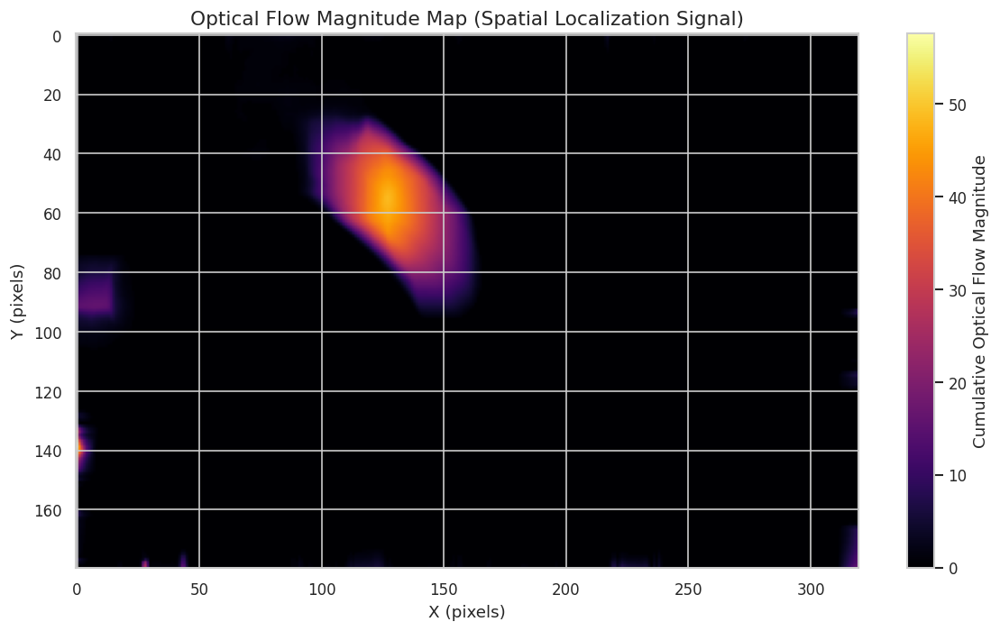
</p>

### 3. Collision Type Classification

Extracts 8 frames around the detected peak, encodes them with CLIP ViT-B/32, and compares the averaged image embedding against 5 text embeddings (one per collision type), each built from 5 prompt templates.

**Collision types:** `head-on` · `rear-end` · `sideswipe` · `single-vehicle` · `t-bone`

---

## Dataset

The competition provides two splits:

| Split | Source | Videos | Annotations |
|-------|--------|--------|-------------|
| Development | CARLA simulator (synthetic) | 2,211 | Accident time, impact coordinates, collision type |
| Test | Real CCTV footage | 2,027 | Hidden (evaluated on Kaggle) |

<p align="center">
  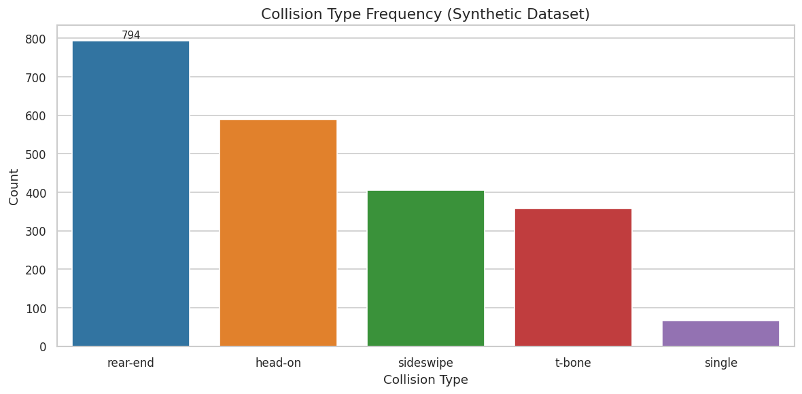
  &nbsp;&nbsp;
  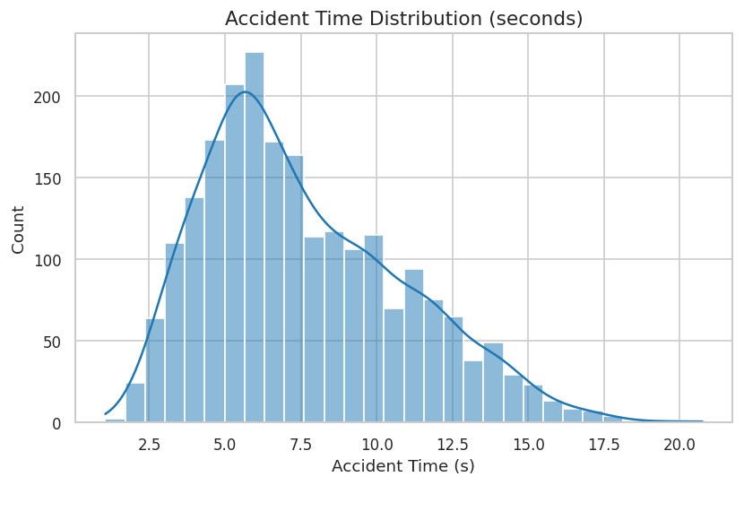
</p>

<p align="center">
  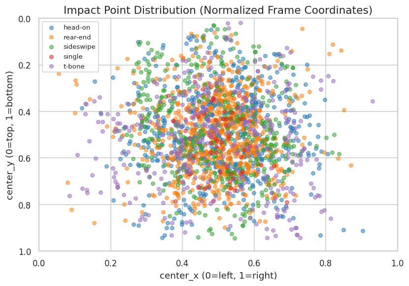
  &nbsp;&nbsp;
  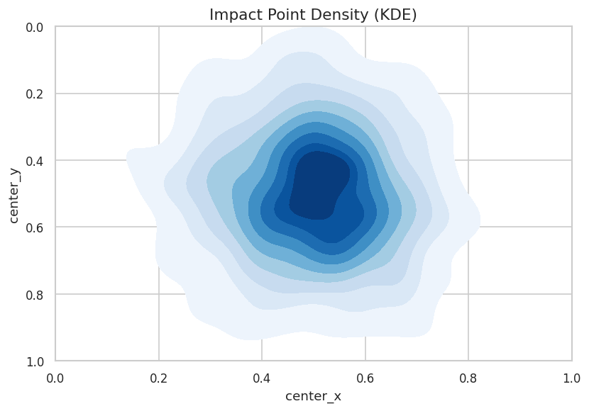
</p>

---

## Results

**Public leaderboard score: 0.25230** (computed on ~25% of test data)

Calibration on a 10-video synthetic subset:

| Component | Mean Score | Best Individual |
|-----------|-----------|-----------------|
| Temporal (𝒯) | 0.438 | 0.94 |
| Spatial (𝒮) | 0.168 | 0.96 |
| Classification (𝒞) | 0.0 | 0.0 |

The classification bottleneck is the primary limitation: CLIP predicts `t-bone` for all calibration videos (which are all `head-on`), driven by the domain gap between internet imagery and CCTV stills.

<p align="center">
  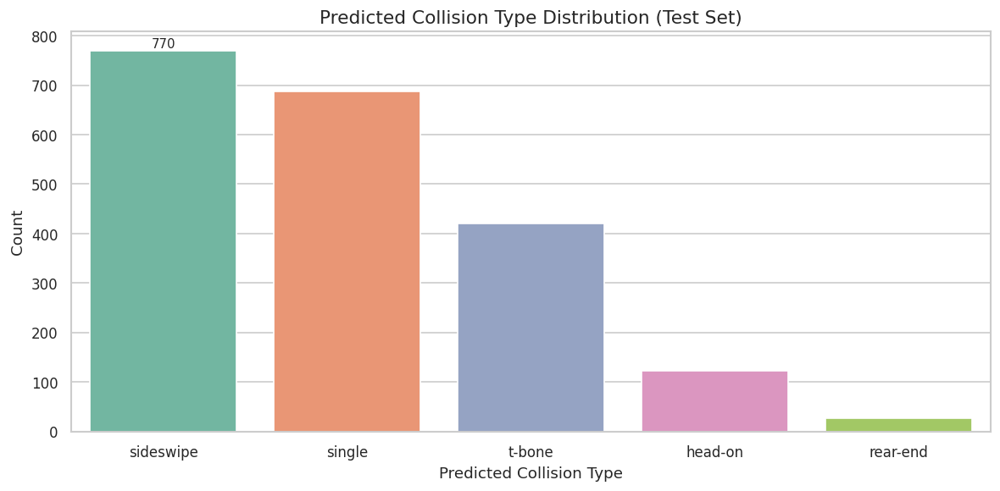
  &nbsp;&nbsp;
  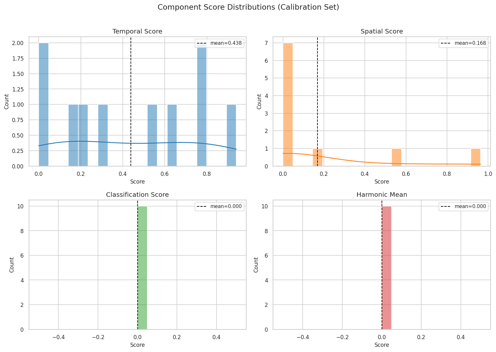
</p>

<p align="center">
  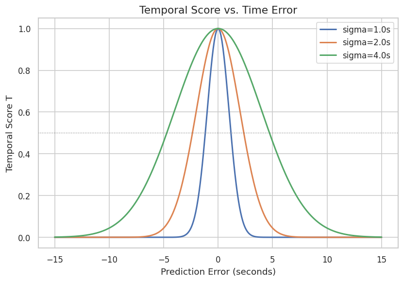
  &nbsp;&nbsp;
  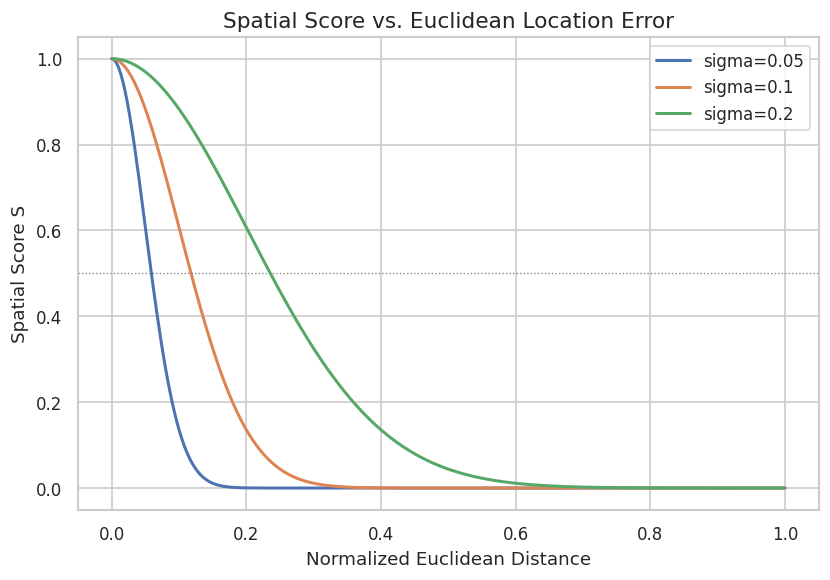
</p>

---

## Repository Structure

```
.
├── paper/                  # CVPR 2026 submission (LaTeX, two-column)
│   ├── main.tex
│   ├── main.bib
│   ├── sec/                # Abstract, intro, method, experiments, conclusion
│   └── fig/                # Figures used in the paper
├── preprint/               # arXiv preprint (LaTeX, single-column)
│   ├── main.tex
│   ├── references.bib
│   ├── arxiv.sty
│   └── images/             # Figures used in the preprint
├── Notebook/               # Kaggle notebook (exported .ipynb)
├── workspace/              # Development notebooks and iterations
├── figure/                 # All diagnostic and analysis figures
└── .github/workflows/      # CI: LaTeX → PDF compilation
```

---

## Quick Start

### Run on Kaggle

[](https://www.kaggle.com/code/ameythakur20/zero-shot-cctv-traffic-accident-understanding/)

The notebook runs end-to-end on a single NVIDIA T4 GPU and processes all 2,027 test videos in approximately 4 hours.

### Build the Paper

The GitHub Actions workflow automatically compiles both the CVPR paper and arXiv preprint on every push. You can also build locally:

```bash
cd paper && latexmk -pdf main.tex
cd preprint && latexmk -pdf main.tex
```

---

## Scoring

The competition uses the harmonic mean of three components:

$$\mathcal{H} = \frac{3}{\frac{1}{\mathcal{T}} + \frac{1}{\mathcal{S}} + \frac{1}{\mathcal{C}}}$$

- **Temporal** (𝒯): Gaussian similarity with σ = 2.0 seconds
- **Spatial** (𝒮): Gaussian similarity with σ = 0.1 (normalized coordinates)
- **Classification** (𝒞): Top-1 accuracy

A zero in any component forces the composite score to zero.

---

## Additional Figures

<details>
<summary>Click to expand all diagnostic figures</summary>

### Bounding Box Statistics
<p align="center">
  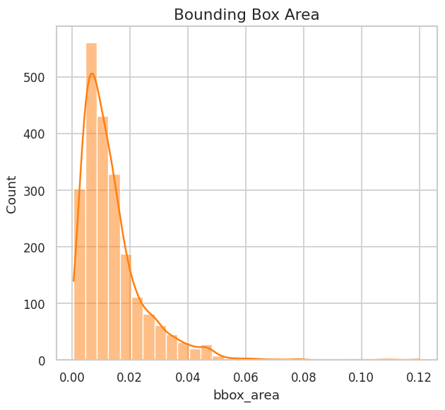
  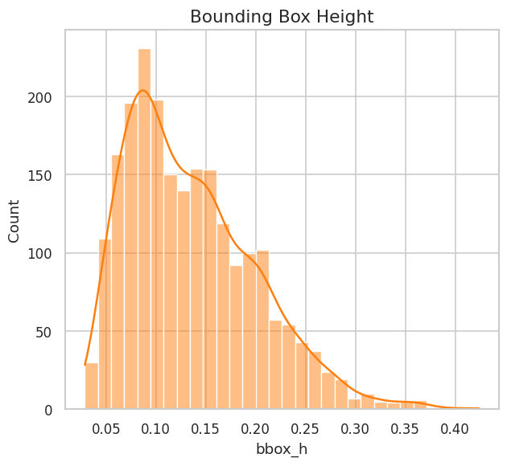
  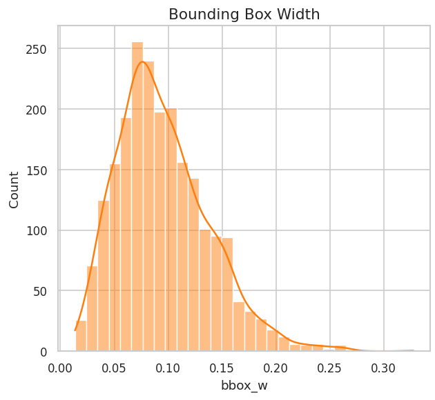
</p>

### Temporal Analysis
<p align="center">
  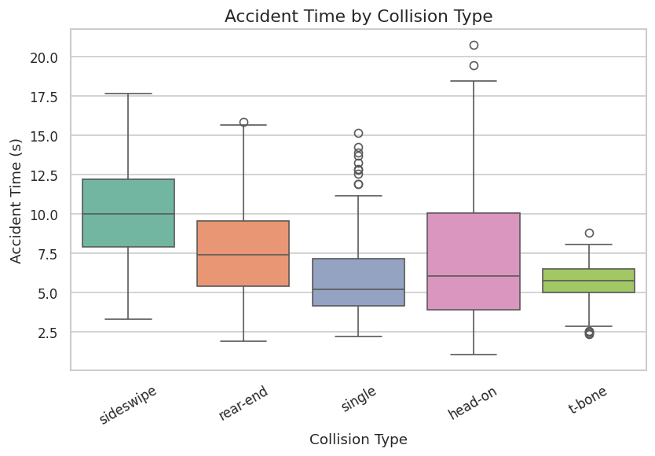
  &nbsp;&nbsp;
  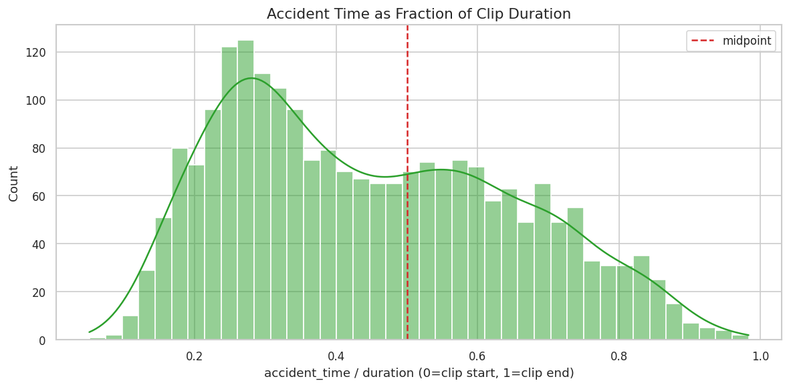
</p>

### Test Set Predictions
<p align="center">
  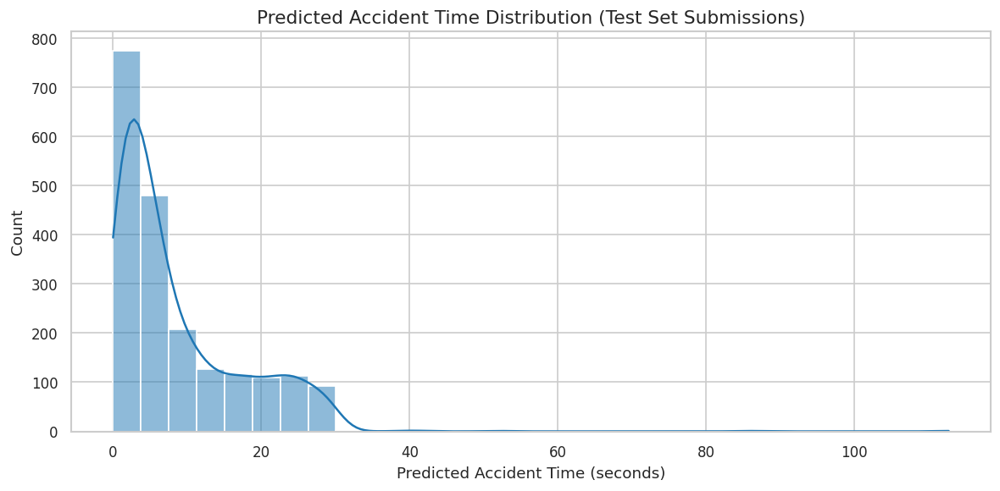
  &nbsp;&nbsp;
  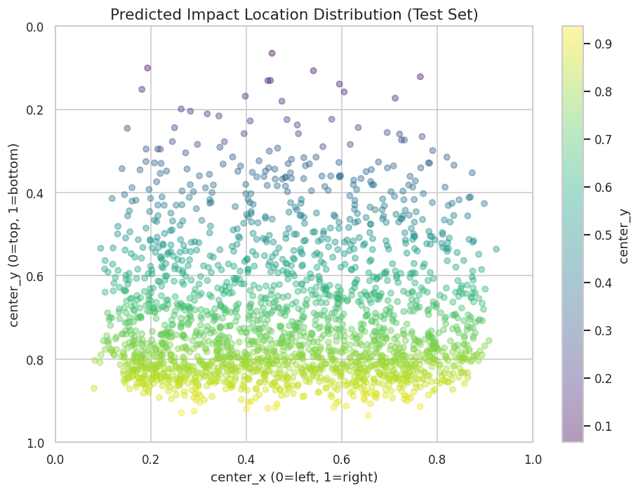
</p>

### Dataset Features
<p align="center">
  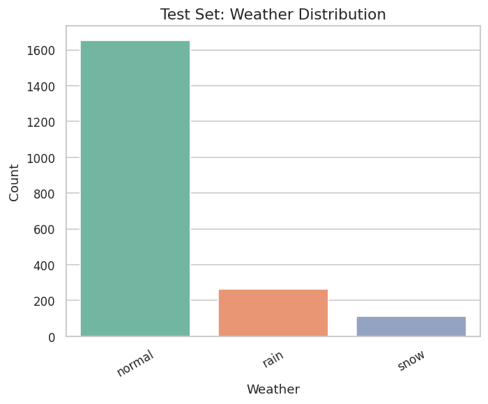
  &nbsp;&nbsp;
  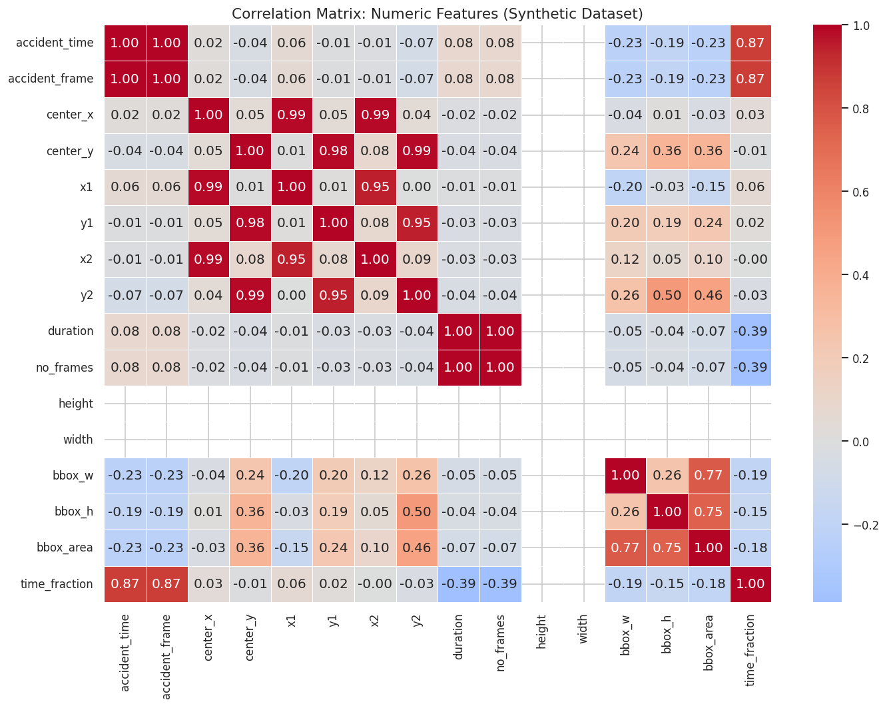
</p>

</details>

---

## Citation

```bibtex
@misc{thakur2026zershot,
  title={A Modular Zero-Shot Pipeline for Accident Detection, Localization, 
         and Classification in Traffic Surveillance Video},
  author={Thakur, Amey and Talele, Sarvesh},
  year={2026},
  howpublished={ACCIDENT @ CVPR 2026 Workshop},
  note={\url{https://www.kaggle.com/code/ameythakur20/zero-shot-cctv-traffic-accident-understanding}}
}
```

---

## References

- Picek, L., Čermák, V., et al. [ACCIDENT @ CVPR 2026](https://kaggle.com/competitions/accident). Kaggle Competition.
- [AUTOPILOT Workshop at CVPR 2026](https://wad.vision/)
- Radford, A., et al. (2021). [Learning Transferable Visual Models from Natural Language Supervision](https://arxiv.org/abs/2103.00020). ICML.
- Farnebäck, G. (2003). Two-Frame Motion Estimation Based on Polynomial Expansion. SCIA.

---

## License

This repository is released for academic research purposes in conjunction with the ACCIDENT @ CVPR 2026 competition.
