<div align="center">

# ACCIDENT @ CVPR 2026

**How much of a traffic accident can be read from a camera that nothing was trained on?**

<br>

A surveillance camera records when a collision happened, where in the frame it
happened, and what kind of collision it was. Reading those three things back out
is normally a supervised problem, solved with footage annotated at the same
site. This repository holds the opposite attempt: three independent modules,
no fine-tuning, no labelled real-world data, and only pre-trained weights.

The maintained repository is
[Amey-Thakur/ACCIDENT-CVPR-2026](https://github.com/Amey-Thakur/ACCIDENT-CVPR-2026),
where issues and discussion are handled.

<br>

[Repository](https://github.com/Amey-Thakur/ACCIDENT-CVPR-2026) &nbsp;·&nbsp;
[Preprint](https://arxiv.org/abs/2604.09685) &nbsp;·&nbsp;
[Explainer](https://github.com/sarveshtalele/ACCIDENT-CVPR_2026/raw/main/.github/media/accident-explainer.mp4) &nbsp;·&nbsp;
[Notebook](https://www.kaggle.com/code/ameythakur20/zero-shot-cctv-traffic-accident-understanding/) &nbsp;·&nbsp;
[Write-up](https://amey-thakur.github.io/posts/2026-04-05-a-modular-zero-shot-pipeline-for-accident-detection-localization-and-classification/) &nbsp;·&nbsp;
[Competition](https://kaggle.com/competitions/accident) &nbsp;·&nbsp;
[Workshop](https://wad.vision/) &nbsp;·&nbsp;
[Discussions](https://github.com/Amey-Thakur/ACCIDENT-CVPR-2026/discussions)

<br>

[](https://github.com/Amey-Thakur/ACCIDENT-CVPR-2026)
[](https://kaggle.com/competitions/accident)
[](https://arxiv.org/abs/2604.09685)
[](https://www.kaggle.com/code/ameythakur20/zero-shot-cctv-traffic-accident-understanding/)
[](https://github.com/openai/CLIP)
[](https://kaggle.com/competitions/accident/leaderboard)
[](https://kaggle.com/competitions/accident)

<br>

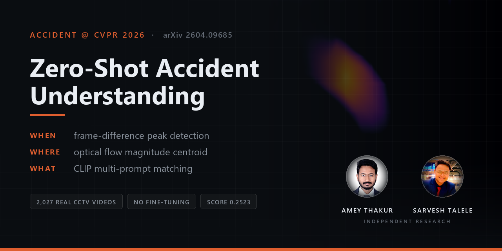

</div>

<!-- AUTHORS -->
<div align="center">

  <a name="authors"></a>
  ## Authors

| <a href="https://github.com/Amey-Thakur"></a><br>[**Amey Thakur**](https://github.com/Amey-Thakur)<br><br>[](https://orcid.org/0000-0001-5644-1575) | <a href="https://github.com/sarveshtalele"></a><br>[**Sarvesh Talele**](https://github.com/sarveshtalele)<br><br>[](https://orcid.org/0009-0002-0818-461X) |
| :---: | :---: |

</div>

> [!IMPORTANT]
> ### 🤝🏻 Special Acknowledgement
> *Special thanks to **[Amey Thakur](https://github.com/Amey-Thakur)** for his meaningful contributions, guidance, and support that helped shape this work.*

---

<br>

## The problem

https://github.com/user-attachments/assets/026e0349-3335-4b21-84d6-36e13dcb3222

<p align="center"><sub>The method in one pass: what the three modules read out of a clip nothing was trained on.</sub></p>

Road traffic crashes kill over one million people each year. Cameras already
record much of it. The difficulty is that methods which read that footage are
trained on annotated video from the site where they run, so every new camera
brings a new annotation bill.

The ACCIDENT @ CVPR 2026 competition removes that option on purpose. Development
material is synthetic, rendered in the CARLA simulator. The test set is real
CCTV, and annotating it by hand is prohibited. Whatever runs on it has to arrive
carrying only what it learned somewhere else.

Three predictions are required for every video.

| Question | Method | Output |
| :--- | :--- | :--- |
| **When** did it happen? | Z-score peak detection on frame differences | Accident time in seconds |
| **Where** was the impact? | Weighted centroid of thresholded Farnebäck optical flow | Normalized `(x, y)` |
| **What type** of collision? | CLIP cosine similarity against multi-prompt text embeddings | One of five classes |

The three modules share no parameters, so any one of them can be replaced
without disturbing the other two.

<br>

## Why the scoring shapes the design

A submission is graded on the harmonic mean of three quantities: a Gaussian
temporal similarity with `σ = 2.0` seconds, a Gaussian spatial similarity with
`σ = 0.1` in normalized coordinates, and top-1 classification accuracy.

$$\mathcal{H} = \frac{3}{\frac{1}{\mathcal{T}} + \frac{1}{\mathcal{S}} + \frac{1}{\mathcal{C}}}$$

A zero anywhere sends the whole score to zero. A method cannot buy a result by
being excellent at the easy component and hopeless at the hard one, and that
property governs how the results below should be read.

<br>

## The pipeline

<p align="center">
  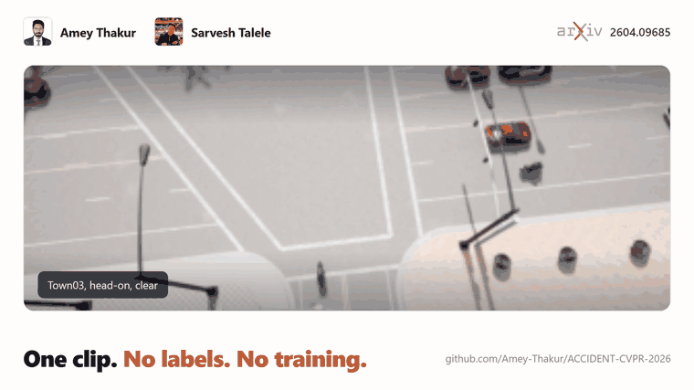
</p>

<p align="center"><sub>All three modules on one clip. The peak fixes <b>when</b>, the flow centroid fixes <b>where</b>, the prompt scores name <b>what</b>.</sub></p>

### 1. When: temporal localization

A collision produces a sudden change in image intensity. The module builds a
one-dimensional signal from mean absolute differences between adjacent frames,
smooths it with a centred rolling mean over `w = 5`, converts it to z-scores
against the whole series, and takes the strongest candidate above `τ = 1.5`.
When nothing crosses the threshold it falls back to the global maximum, so it
always returns an answer.

<p align="center">
  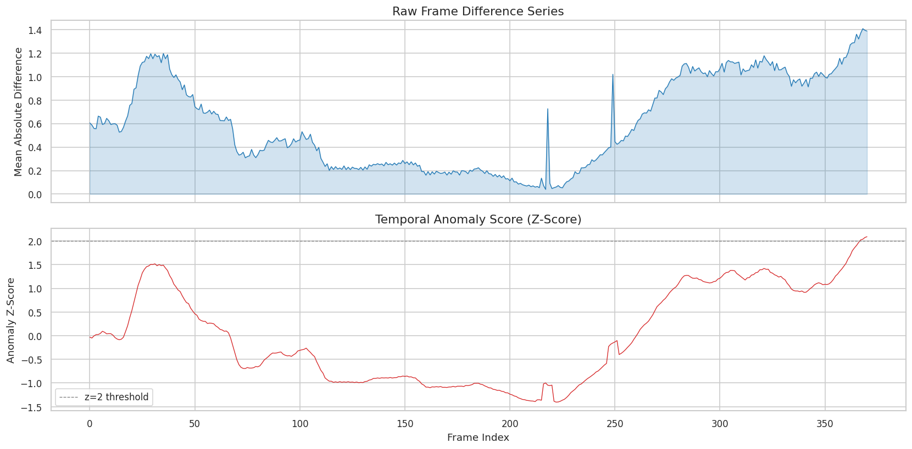
</p>

The smoothing step earns its place here. The raw signal mixes slow drift from
vehicles crossing the scene with sharp transients, and after normalization the
shape of the event survives while isolated single-frame spikes do not.

### 2. Where: spatial impact localization

A collision concentrates high-magnitude motion into a small part of the image.
The module centres a 30-frame window on the predicted time, runs Farnebäck dense
optical flow over every consecutive pair, sums the displacement magnitudes, and
discards everything below the 90th percentile. The impact point is the weighted
centroid of what remains.

<p align="center">
  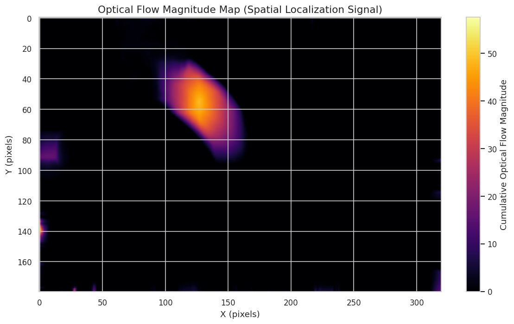
</p>

The percentile threshold is what separates a collision from busy traffic:
diffuse motion spread across the frame is dropped, and only the dense cluster
survives to be averaged.

### 3. What: collision type classification

Eight frames around the predicted time are encoded with CLIP ViT-B/32,
L2-normalized and averaged into one vector. That vector is compared by cosine
similarity against five text vectors, one per class, each built by averaging
five written descriptions of the collision as a bystander would put it.

| Type | Example prompt |
| :--- | :--- |
| `head-on` | "two cars colliding head-on from opposite directions" |
| `rear-end` | "a car colliding into the back of another car" |
| `sideswipe` | "two vehicles scraping alongside each other" |
| `single` | "a single car crashing into a wall or obstacle" |
| `t-bone` | "a car hitting the side of another car at an intersection" |

<br>

### The method in full

<p align="center">
  <a href="https://github.com/sarveshtalele/ACCIDENT-CVPR_2026/raw/main/.github/media/accident-explainer.mp4">
    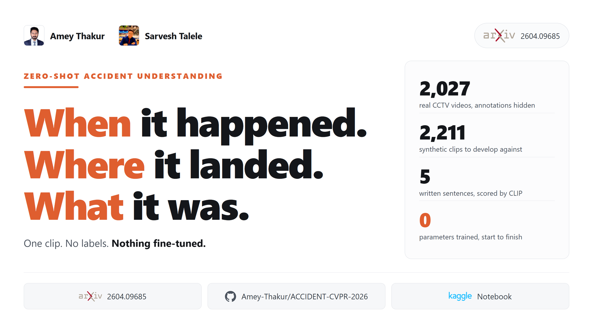
  </a>
</p>

<p align="center"><sub><b>Explainer video.</b> A walkthrough of the three modules end to end. Click the frame above to play it, or <a href="https://github.com/sarveshtalele/ACCIDENT-CVPR_2026/raw/main/.github/media/accident-explainer.mp4">download the file</a>.</sub></p>

<br>

## Dataset

| Split | Source | Videos | Annotations |
| :--- | :--- | ---: | :--- |
| Development | CARLA simulator, synthetic | 2,211 | Time, impact coordinates, type |
| Test | Real CCTV footage | 2,027 | Hidden, evaluated on Kaggle |

Synthetic videos are rendered at 1920 × 1080 at a fixed 20 FPS. Clip length runs
from 5.8 to 32.2 seconds, mean 17.7. The ground-truth accident falls at a median
of 6.9 seconds into the clip, so most collisions sit in the first half of the
recording. Impact coordinates cluster near the frame centre, with both means
near 0.50.

<p align="center">
  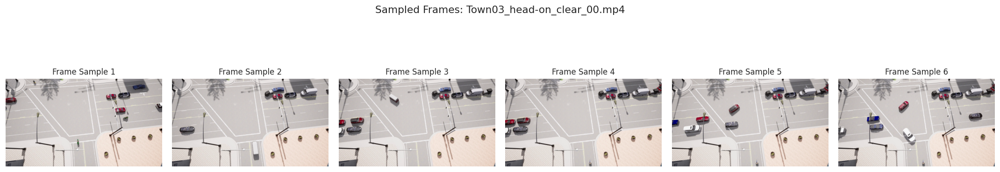
</p>

<p align="center">
  
  &nbsp;&nbsp;
  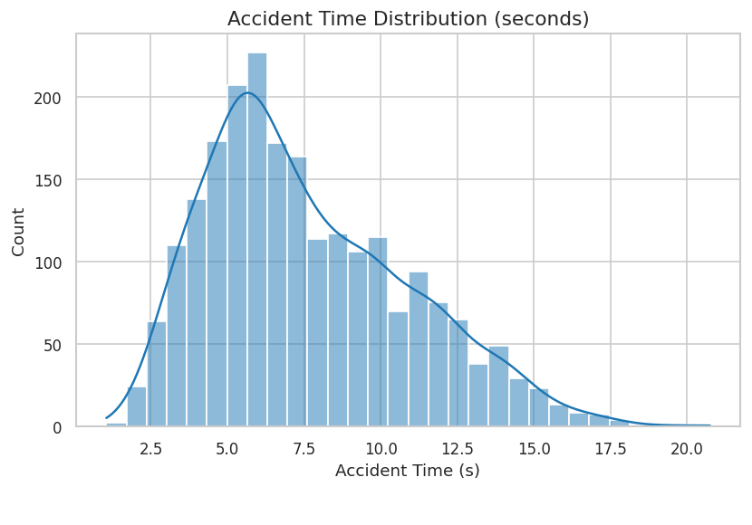
</p>

<p align="center">
  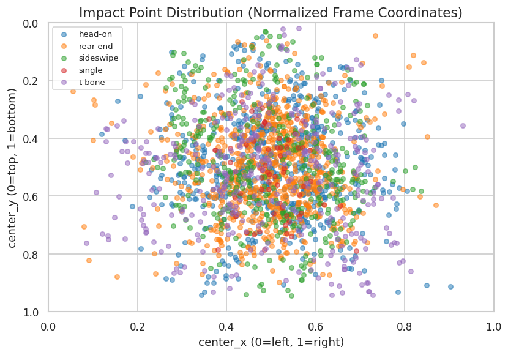
  &nbsp;&nbsp;
  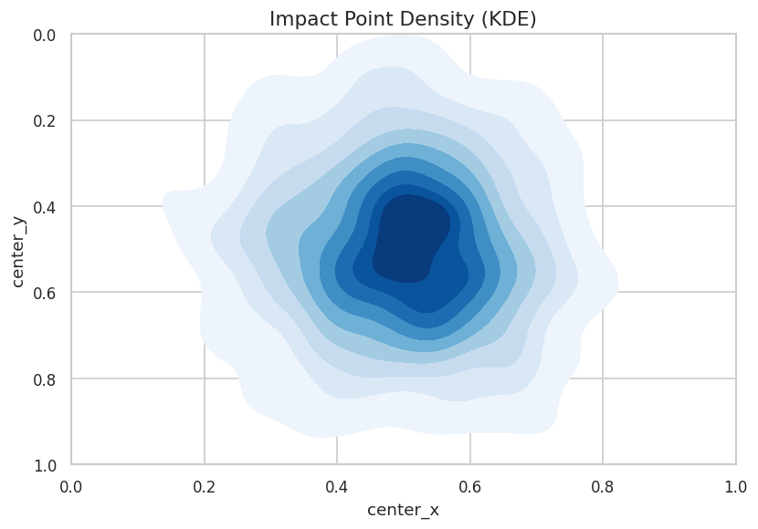
</p>

The classes are far from balanced: rear-end holds 794 videos and single-vehicle
holds 66. That central clustering of impact points also sets a floor, because a
prediction that simply guesses the centre is already not terrible.

<br>

## Results

**Public leaderboard score: 0.2523**, computed on approximately 25% of the test
data. The final ranking uses the remaining 75%.

The breakdown is the more useful number. On a ten-video calibration subset drawn
from the synthetic split:

| Component | Mean score | Best individual |
| :--- | ---: | ---: |
| Temporal `𝒯` | 0.438 | 0.94 |
| Spatial `𝒮` | 0.168 | 0.96 |
| Classification `𝒞` | 0.0 | 0.0 |

The best individual temporal and spatial scores show that when the pipeline
locks on to the right event, both estimates can be accurate. The composite on
this subset is nevertheless zero: all ten calibration videos are head-on
collisions and CLIP answers t-bone for every one of them. Under a harmonic mean
that settles the matter. This is a property of the calibration subset rather
than a claim about the whole test set, but it points straight at where the loss
is concentrated.

<p align="center">
  
  &nbsp;&nbsp;
  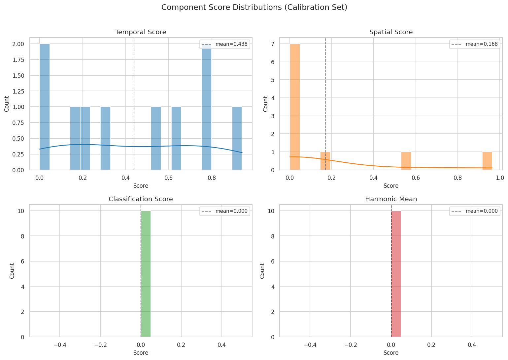
</p>

The predicted distribution inverts the training distribution almost exactly.

| Collision type | Development split | Predicted on test |
| :--- | ---: | ---: |
| Rear-end | 794 | 23 |
| Head-on | 588 | 122 |
| Sideswipe | 405 | 770 |
| T-bone | 358 | 425 |
| Single-vehicle | 66 | 687 |

A shift of that size is not a small calibration error. It says the similarity
scores are responding to viewing angle and scene geometry rather than to the
dynamics of the collision.

<p align="center">
  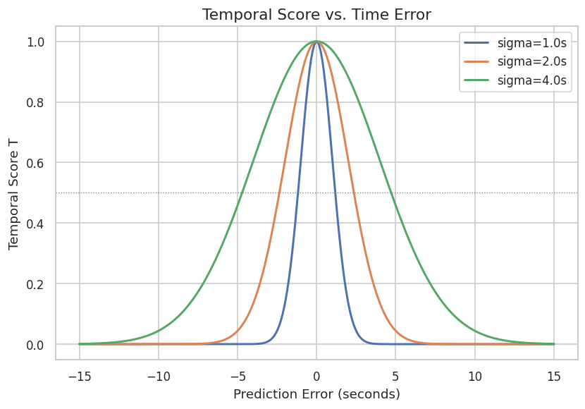
  &nbsp;&nbsp;
  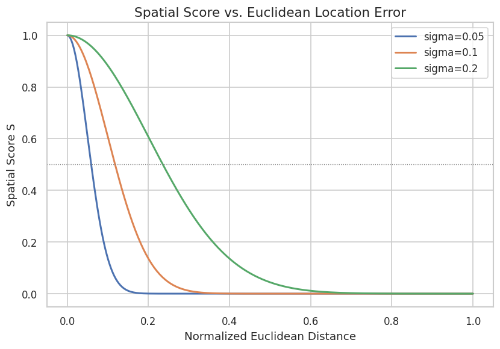
</p>

<br>

## Where it fails

**Temporal.** The frame-difference signal cannot tell a collision from any other
sudden change. Swaying vegetation, cloud shadows and camera shake all produce
spikes of comparable magnitude.

**Spatial.** The centroid is an average, so it drifts when several vehicles move
at once and the weighted mean spreads across every active region.

**Classification.** This is the bottleneck. CLIP was trained on internet
photographs taken at roughly eye level, and CCTV views are overhead or steeply
oblique. It is being asked to recognise a geometry it has hardly seen.

<br>

## What would improve it

Because the modules are independent, the next step is cheap. Replacing Farnebäck
with a learned estimator such as RAFT should improve displacement accuracy at
the low resolutions used here. More importantly, fine-tuning the CLIP visual
encoder on the synthetic split attacks the domain gap directly, and that gap is
the largest single source of loss above.

<br>

## Repository

```
.
├── paper/                  # CVPR 2026 submission, two-column LaTeX
│   ├── main.tex
│   ├── main.bib
│   ├── preamble.tex
│   ├── cvpr.sty
│   ├── sec/                # Abstract, introduction, method, experiments, conclusion
│   └── fig/                # Figures used in the paper
├── preprint/               # arXiv preprint, single-column LaTeX
│   ├── main.tex
│   ├── references.bib
│   ├── arxiv.sty
│   └── images/             # Figures used in the preprint
├── Notebook/               # Kaggle notebook, exported
├── figure/                 # Every diagnostic and analysis figure
└── .github/workflows/      # Compiles both PDFs on push
```

<br>

## Running it

### The pipeline

[](https://www.kaggle.com/code/ameythakur20/zero-shot-cctv-traffic-accident-understanding/)

The notebook runs end to end on a single NVIDIA T4 and processes all 2,027 test
videos in approximately two hours. No weights are trained or fine-tuned.

### The paper

The workflow in `.github/workflows/latex_to_pdf.yml` compiles both documents on
every push and uploads them as artifacts. To build either one locally:

```bash
cd paper    && latexmk -pdf main.tex
cd preprint && latexmk -pdf main.tex
```

<br>

## Every figure

<details>
<summary>Diagnostics that did not make the paper</summary>

<br>

### Bounding box statistics

<p align="center">
  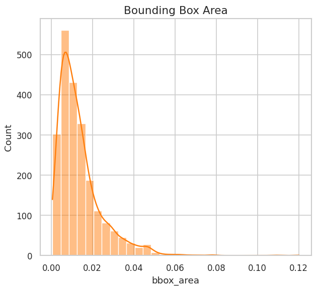
  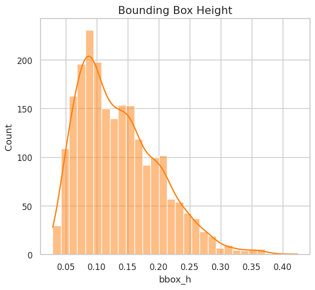
  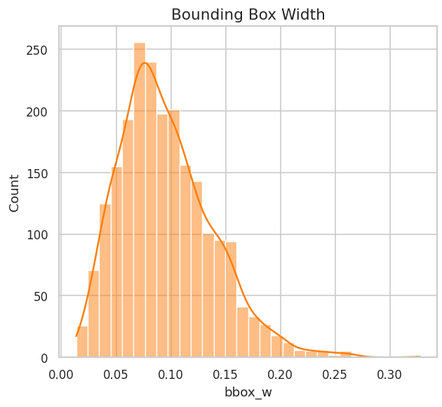
</p>

### Temporal analysis

<p align="center">
  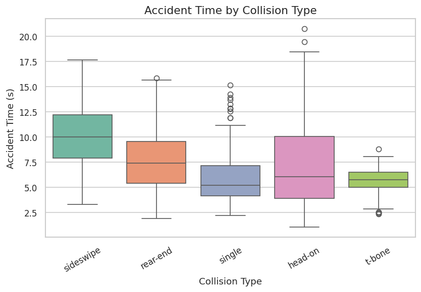
  &nbsp;&nbsp;
  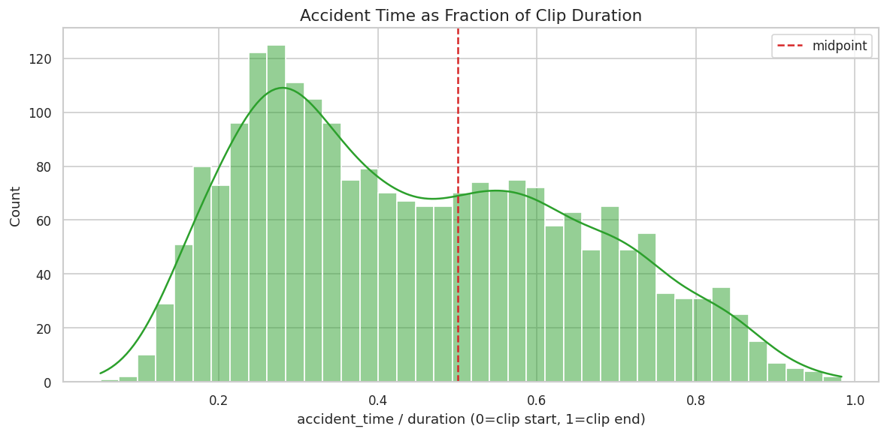
</p>

### Test set predictions

<p align="center">
  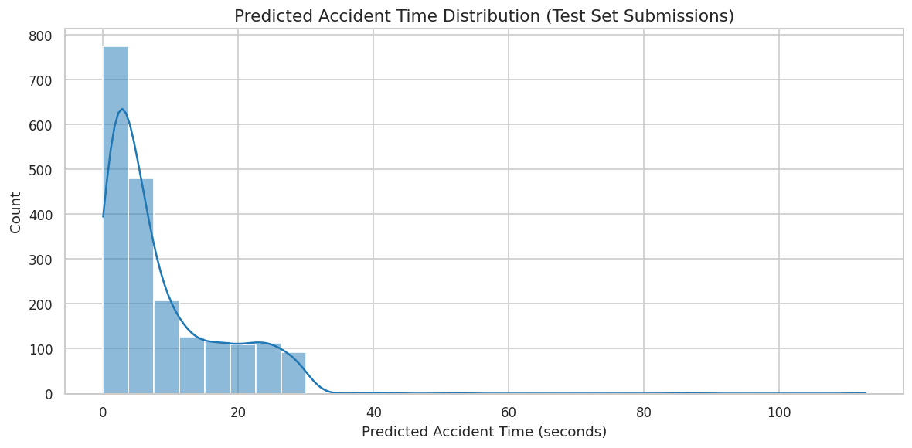
  &nbsp;&nbsp;
  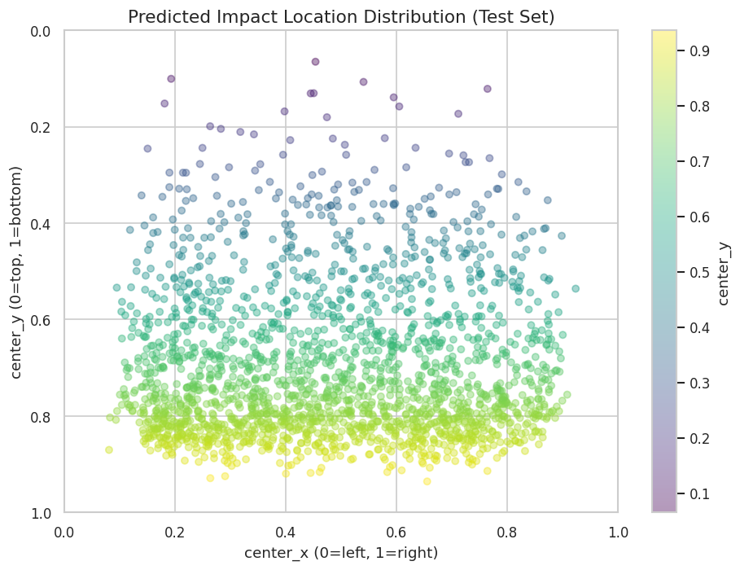
</p>

### Dataset features

<p align="center">
  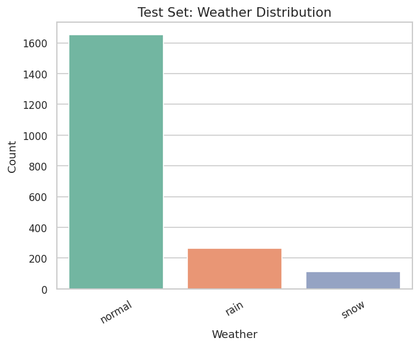
  &nbsp;&nbsp;
  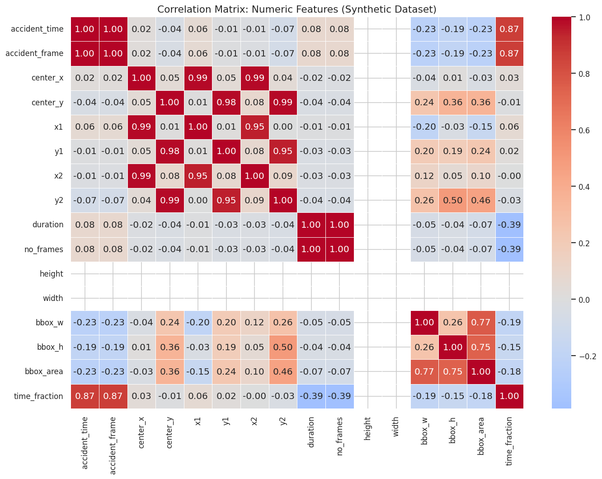
</p>

</details>

<br>

## Citation

```bibtex
@article{thakur2026accident,
  title   = {A Modular Zero-Shot Pipeline for Accident Detection, Localization,
             and Classification in Traffic Surveillance Video},
  author  = {Thakur, Amey and Talele, Sarvesh},
  journal = {arXiv preprint arXiv:2604.09685},
  year    = {2026},
  url     = {https://arxiv.org/abs/2604.09685}
}
```

<br>

## References

- Picek, L., Čermák, V., et al. [ACCIDENT @ CVPR 2026](https://kaggle.com/competitions/accident). Kaggle Competition, 2026.
- [AUTOPILOT Workshop at CVPR 2026](https://wad.vision/).
- Radford, A., et al. [Learning Transferable Visual Models from Natural Language Supervision](https://arxiv.org/abs/2103.00020). ICML, 2021.
- Farnebäck, G. [Two-Frame Motion Estimation Based on Polynomial Expansion](https://doi.org/10.1007/3-540-45103-X_50). SCIA, 2003.
- Dosovitskiy, A., et al. [CARLA: An Open Urban Driving Simulator](https://proceedings.mlr.press/v78/dosovitskiy17a.html). CoRL, 2017.
- Teed, Z., and Deng, J. [RAFT: Recurrent All-Pairs Field Transforms for Optical Flow](https://doi.org/10.1007/978-3-030-58536-5_24). ECCV, 2020.

<br>

## License

Released for academic research in connection with the ACCIDENT @ CVPR 2026
competition. The CVPR style files under `paper/` and the arXiv style file under
`preprint/` carry the licences of their own authors.

<br>

<div align="center">

**[Repository](https://github.com/Amey-Thakur/ACCIDENT-CVPR-2026)** &nbsp;·&nbsp;
**[Preprint](https://arxiv.org/abs/2604.09685)** &nbsp;·&nbsp;
**[Notebook](https://www.kaggle.com/code/ameythakur20/zero-shot-cctv-traffic-accident-understanding/)** &nbsp;·&nbsp;
**[Write-up](https://amey-thakur.github.io/posts/2026-04-05-a-modular-zero-shot-pipeline-for-accident-detection-localization-and-classification/)** &nbsp;·&nbsp;
**[Discussions](https://github.com/Amey-Thakur/ACCIDENT-CVPR-2026/discussions)**

</div>
